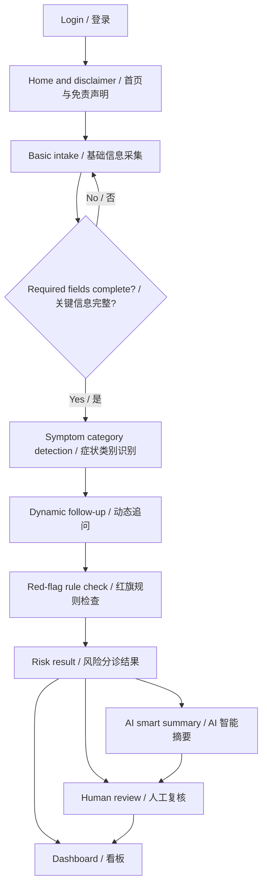
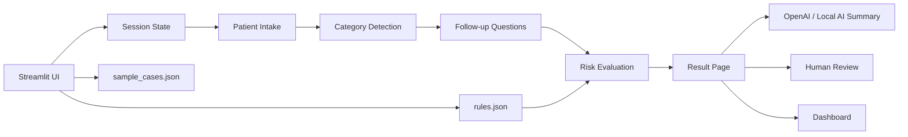

# Medical Prototype Design

**Project:** MedGuide AI: 医疗智能预问诊与风险分诊助手  
**Team members:** Yiyi Shen, Qianfeng Song, Chengwen Sui, Yingchen Wang, and Luliang Zhao  
**Current version:** Streamlit runnable prototype, updated 2026-04-22  
**Primary color:** `#4a90e2`

## 1. Product Goal

The prototype helps users complete structured symptom collection before a formal medical consultation. It supports risk triage, red-flag reminders, and human review.

核心目标：

- 提高预问诊信息完整度。
- 缩短人工初筛时间。
- 用规则优先机制提示高风险症状。
- 帮助导诊人员更快理解用户情况。
- 明确 AI 辅助边界，不替代医生诊断。

## 2. User Roles

| Role | Needs |
| --- | --- |
| Patient / general user | Enter symptoms, answer follow-up questions, understand next-step guidance. |
| Triage staff / nurse | Review structured summary, confirm risk level, adjust department if needed. |
| Project presenter | Demonstrate AI application, business value, and safety reflection. |

## 3. Implemented Pages

### Page 0. Login

Purpose:

- Show user entry.
- Demonstrate basic access boundary.
- Support bilingual interface selection.

Current demo accounts:

| Username | Password | Purpose |
| --- | --- | --- |
| `demo` | `demo123` | General demo user |
| `nurse` | `triage123` | Triage review user |

Database decision:

- The course prototype does not need a database.
- Demo users are stored in code.
- Login state is stored in `st.session_state`.
- Real deployment should use database-backed authentication or hospital account integration.

### Page 1. Home and Disclaimer

Purpose:

- Explain what the system does.
- Clarify that it is not a diagnosis tool.
- Show supported scenarios.
- Allow users to start intake or view sample cases.

Main content:

- Project title.
- Safety disclaimer.
- Supported categories: respiratory, digestive, skin.
- Start button.
- Sample case preview.

### Page 2. Basic Intake

Purpose:

- Collect baseline information needed for triage.

Fields:

- Age.
- Sex.
- Pregnancy status.
- Chief complaint.
- Symptom duration.
- Severity level from 1 to 5.
- Warning signs.
- Medical history.
- Current medication.
- Allergies.

Design notes:

- Use select boxes and sliders for structured fields.
- Keep chief complaint as free text to preserve natural patient expression.
- Validate key fields before moving to follow-up.

### Page 3. Dynamic Follow-Up

Purpose:

- Ask targeted questions based on symptom category.

Supported categories:

- Respiratory.
- Digestive.
- Skin.
- General fallback.

Example follow-up questions:

Respiratory:

- Are you having difficulty breathing?
- Do you have chest pain?
- Are you coughing up sputum?
- What color is the sputum?
- What was your highest temperature?

Digestive:

- Have you been vomiting?
- Do you have diarrhea?
- Is there blood in the stool?
- Where is the abdominal pain located?
- Are you unable to eat or drink?

Skin:

- Is it itchy?
- Is there discharge or broken skin?
- How fast is the rash spreading?
- Is it accompanied by fever?
- Have you recently been exposed to an allergen?

### Page 4. Triage Result

Purpose:

- Show the structured outcome of the pre-consultation.

Output modules:

- Risk level.
- Recommended department.
- Structured summary.
- Reasoning.
- Red-flag findings.
- Follow-up answer record.
- JSON export.
- AI Smart Summary generation.
- Buttons for human review, dashboard, or new intake.

Risk levels:

| Risk Level | Meaning |
| --- | --- |
| Emergency Care | Immediate emergency attention. |
| See a Doctor Soon | Arrange in-person care soon. |
| Outpatient Visit | Regular clinic visit is appropriate. |
| Home Observation | Observe at home with warning boundaries. |

AI Smart Summary behavior:

- If OpenRouter API is configured, the app uses model `minimax/minimax-m2.5:free` to generate a concise pre-consultation summary.
- If API configuration is missing, the app uses a local fallback summary so the demo remains runnable.
- The prompt explicitly forbids diagnosis, medication advice, and treatment recommendations.

### Page 5. Human Review

Purpose:

- Demonstrate AI assistance with human oversight.

Functions:

- Show patient summary.
- Show follow-up records.
- Allow staff to choose final department.
- Allow staff to select final action.
- Save review notes.

Design principle:

> The system supports triage staff; it does not replace them.

### Page 6. Rules and Evaluation Dashboard

Purpose:

- Support technical credibility and business-value discussion.

Modules:

- Quantified benefit examples.
- Sample-case consistency.
- Red-flag rule table.
- Completed cases in current session.
- Future extension list.

## 4. Main User Flow

## 5. Technical Flow

## 6. Data Design

### 6.1 Sample Case Schema

Each sample case includes:

- Case ID.
- Bilingual case name.
- Category.
- Patient profile.
- Chief complaint.
- Follow-up answers.
- Expected risk level.

Current sample cases:

- Respiratory case.
- Digestive case.
- Skin concern case.
- High-risk emergency case.

### 6.2 Rule Schema

Each rule includes:

- Category.
- Bilingual label.
- Risk level.
- Recommended action.

The current rule table is for course demonstration only and must not be treated as clinical guidance.

## 7. UI Style

Visual direction:

- Clean clinical blue theme.
- Main color: `#4a90e2`.
- Light background for calmness and readability.
- No blue vertical title bar before headings.
- Clear card-style sections for result and dashboard pages.

Interaction principles:

- Keep medical warnings visible.
- Avoid suggesting certainty.
- Explain reasoning in plain language.
- Make human review easy to access.

## 8. Key Design Decisions

### 8.1 Why Add Login

Login helps show:

- User entry.
- Access boundary.
- Future permission design.

It is intentionally simple because the prototype is for demonstration.

### 8.2 Why No Database Yet

No database is needed because:

- There is no real patient data.
- The goal is workflow demonstration.
- Local setup should remain simple.
- Privacy risk is lower.

Future production should add:

- User database or identity provider.
- Encrypted storage.
- Role-based permissions.
- Audit logs.
- Secure deployment.

### 8.3 Why Rule-First

Rule-first design is safer for healthcare scenarios because:

- Red flags remain explicit.
- High-risk symptoms can override normal flow.
- The output is easier to explain in Q&A.
- Human review stays central.

## 9. Demo Script

Recommended live demo:

1. Open the app and show login.
2. Log in with `demo / demo123`.
3. Show language switch.
4. Load the high-risk sample case.
5. Complete intake and follow-up.
6. Show emergency triage result.
7. Move to human review.
8. Open dashboard and explain quantified value.

Backup demo:

- Use screenshots if the local environment or projector is unstable.

## 10. Definition of Done Checklist

| Requirement | Status |
| --- | --- |
| Runnable prototype | Completed in `app.py`. |
| Bilingual UI | Completed. |
| Login page | Completed with demo accounts. |
| Database decision | Documented: not required for course prototype. |
| Optional OpenAI summary | Completed with local fallback. |
| Dynamic follow-up | Completed for respiratory, digestive, and skin categories. |
| Rule-based risk triage | Completed using local JSON rules. |
| Human review | Completed. |
| Dashboard | Completed. |
| Report and slide support | Covered in project documents. |

## 11. Limitations

- Current cases are simulated, not real clinical data.
- Rules are simplified for course demonstration.
- No real clinical validation has been performed.
- No persistent database or production authentication.
- The prototype cannot diagnose disease or recommend treatment.

## 12. Future Improvements

- Add more symptom categories.
- Add persistent secure storage.
- Add role-based permissions.
- Add clinician-reviewed rule library.
- Add more evaluation cases.
- Add exportable PDF summaries.
- Integrate an LLM for controlled summarization while keeping rule-based safety constraints.
