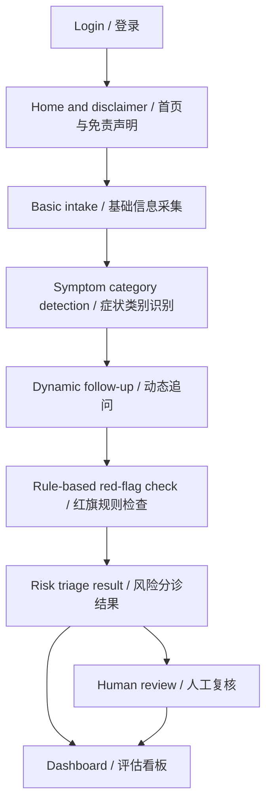

# MedGuide AI

医疗智能预问诊与风险分诊助手  
AI Pre-Consultation and Risk Triage Assistant

## 1. Project Status

This folder contains the current runnable course prototype for the group project.

当前版本已经完成：

- 可运行的 `Streamlit` 原型应用。
- 中文 / English 双语界面。
- 登录页面与演示账号。
- 基础信息采集、动态追问、风险分诊、人工复核、规则与评估看板。
- 可选 OpenAI API 智能摘要模块；未配置 API key 时自动使用本地兜底摘要。
- 本地 JSON 规则表和样例病例。
- 主色调统一为 `#4a90e2`。

The prototype is designed for course demonstration only. It does not provide medical diagnosis, treatment, or professional medical advice.

## 2. Project Positioning

核心定位：

> 我们做的不是 AI 自动诊断系统，而是 AI 辅助预问诊、风险分级与导诊建议系统。

The product helps users organize symptoms before a formal consultation and helps triage staff review structured information more efficiently.

## 3. Why This Topic

门诊前流程常见问题包括：

- 患者主诉表达不完整，前台或导诊人员需要重复追问。
- 人工初筛依赖经验，不同人员之间的一致性有限。
- 高风险症状如果未被及时识别，可能带来安全风险。
- 医护资源有限，需要把更多时间留给真正需要人工判断的病例。

MedGuide AI uses a rule-first workflow plus structured AI-style interaction to improve efficiency while keeping a human review boundary.

## 4. Core Features

### 4.1 Demo Login

The prototype includes a simple login page.

当前课程原型不需要连接数据库。登录逻辑使用代码内置演示账号和 `st.session_state`，目的是展示用户入口、访问边界和后续真实部署时的权限设计方向。

Demo accounts:

| Username | Password | Role |
| --- | --- | --- |
| `demo` | `demo123` | General demo user |
| `nurse` | `triage123` | Triage review user |

真实部署时建议替换为数据库、医院账号系统或第三方身份认证服务，并加入密码加密、权限控制、审计日志和会话过期机制。

### 4.2 Bilingual Interface

用户可以在登录页或侧边栏切换：

- 中文
- English

The bilingual version supports a clearer final presentation and makes the prototype easier to demonstrate to mixed-language audiences.

### 4.3 Intake Form

The intake page collects key information:

- Age, sex, pregnancy status.
- Chief complaint.
- Symptom duration and severity.
- Warning signs such as fever, pain, bleeding, and breathing difficulty.
- Medical history, current medication, and allergies.

### 4.4 Dynamic Follow-Up

The system identifies the symptom category and asks targeted follow-up questions.

Supported scenarios:

- Respiratory symptoms.
- Digestive symptoms.
- Skin concerns.
- General symptoms.

### 4.5 Risk Triage

The prototype outputs one of four risk levels:

| Risk Level | Meaning |
| --- | --- |
| Emergency Care | Immediate emergency attention is recommended. |
| See a Doctor Soon | In-person care should be arranged soon. |
| Outpatient Visit | Regular outpatient or specialist visit is appropriate. |
| Home Observation | Home observation may be acceptable with clear warning boundaries. |

### 4.6 Human Review

The review page allows triage staff to:

- Read the structured patient summary.
- Check triggered rules and follow-up answers.
- Accept or adjust the recommended department.
- Save review notes.

This supports the principle of AI assistance with human oversight.

### 4.7 Dashboard

The dashboard supports the project’s business-value and evaluation story:

- Quantified benefit examples.
- Sample-case consistency.
- Red-flag rule table.
- Completed cases in the current session.
- Future extension ideas.

### 4.8 AI Smart Summary

The result page includes an AI Smart Summary section.

Two modes are supported:

- Real AI mode: if `OPENAI_API_KEY` is configured and the `openai` package is installed, the app calls the OpenAI Responses API to generate a concise triage-facing summary.
- Local fallback mode: if no API key or SDK is available, the app generates a structured local fallback summary so the classroom demo remains runnable.

The AI summary is intentionally constrained:

- It organizes pre-consultation information.
- It does not diagnose disease.
- It does not recommend medication or treatment.
- It reminds users that human review is required for high-risk or incomplete cases.

## 5. System Workflow



## 6. Quantifiable Value

The project should explain benefits using measurable indicators.

Suggested evaluation assumptions for the report:

| Metric | Manual Process | AI Prototype | Estimated Improvement |
| --- | --- | --- | --- |
| Average intake time | 8 minutes | 3 minutes | -62.5% |
| Structured information completeness | 60% | 90% | +50% |
| Daily pre-screening capacity | 50 cases | 90 cases | +80% |
| Red-flag reminder consistency | Experience-dependent | Rule-first reminder | More stable |

These numbers should be presented as simulated course evaluation values, not real hospital performance claims.

## 7. Technology Stack

Current runnable version:

- Frontend and prototype runtime: `Streamlit`.
- Language: `Python`.
- Optional AI: OpenAI Responses API via the official `openai` Python SDK.
- Data files: local JSON.
- State management: `st.session_state`.
- Theme: `.streamlit/config.toml`.

Planned real-world extension:

- Authentication provider or hospital account system.
- Database for patient records and audit logs.
- Role-based access control.
- Clinical validation and compliance review.
- Optional LLM integration for more flexible natural-language summarization.

## 8. Project Structure

```text
Group project/
|-- app.py
|-- README.md
|-- REPORT_OUTLINE.md
|-- SLIDES_OUTLINE.md
|-- MEDICAL_PROTOTYPE_DESIGN.md
|-- requirements.txt
|-- .streamlit/
|   |-- config.toml
|-- data/
|   |-- rules.json
|   |-- sample_cases.json
|-- __pycache__/
|   |-- app.cpython-311.pyc
```

`__pycache__` is generated automatically by Python and does not need manual editing.

## 9. Local Run

Install dependencies:

```bash
pip install -r requirements.txt
```

Run the app:

```bash
streamlit run app.py
```

Then open the local Streamlit URL shown in the terminal.

Optional OpenAI setup:

```bash
set OPENAI_API_KEY=your_api_key_here
set OPENAI_MODEL=gpt-5-mini
streamlit run app.py
```

You can also copy `.streamlit/secrets.example.toml` to `.streamlit/secrets.toml` and fill in your own key locally. Do not submit or share real API keys.

## 10. Presentation Plan

For the 15-minute final presentation, use this order:

1. Problem and project boundary.
2. Prototype demo with login, bilingual switch, intake, follow-up, triage result, review page.
3. Technical design and rule-first safety logic.
4. Quantified value and business strategy.
5. Critical reflection and Q&A.

All team members should participate in both presentation and Q&A.

## 11. Safety Boundary

This prototype is for academic demonstration only.

It does not:

- Diagnose diseases.
- Recommend treatment plans.
- Replace professional clinicians.
- Process real patient data.

In real deployment, the system must pass privacy, security, clinical-safety, and compliance review before use.

## 12. Related Files

- `MEDICAL_PROTOTYPE_DESIGN.md`: detailed feature pages and flow diagrams.
- `REPORT_OUTLINE.md`: written report structure.
- `SLIDES_OUTLINE.md`: 15-minute presentation structure.
- `data/rules.json`: red-flag rule examples.
- `data/sample_cases.json`: bilingual demo cases.
