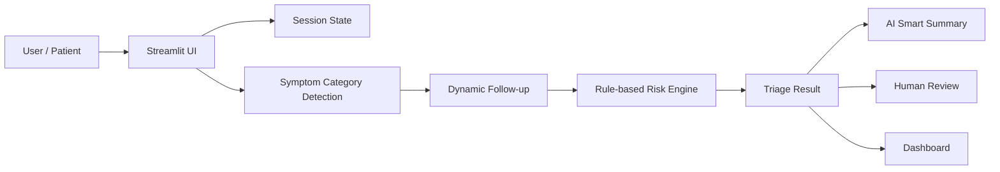

# MedGuide AI: AI Pre-Consultation and Risk Triage Assistant

**Chinese title:** 医疗智能预问诊与风险分诊助手  
**Team members:** Yiyi Shen, Qianfeng Song, Chengwen Sui, Yingchen Wang, and Luliang Zhao  
**Submission:** Written report + presentation slides + runnable prototype  
**Presentation date:** April 26, 2026  
**Prototype type:** Streamlit runnable application  
**Live demo:** https://medguide-ai-demo.streamlit.app/  

## 1. Executive Summary

MedGuide AI is a runnable AI application prototype designed for pre-consultation symptom collection and risk triage support. The project addresses a common problem in outpatient and online healthcare workflows: before a formal medical consultation, patients often provide incomplete or unstructured symptom descriptions, while front-desk or triage staff need to repeatedly ask baseline questions. This process can be time-consuming, inconsistent, and risky when red-flag symptoms are not clearly surfaced.

Our solution is a bilingual Streamlit prototype that supports login, symptom intake, dynamic follow-up, rule-based risk triage, AI Smart Summary generation, human review, and an evaluation dashboard. The system does not diagnose diseases or recommend treatment. Instead, it organizes pre-consultation information, highlights risk signals, and supports human decision-making.

The project uses a rule-first design for safety. Red-flag symptoms such as chest pain with breathing difficulty, blood in stool, inability to eat or drink, and fast-spreading rash with fever are prioritized before normal recommendations. The optional AI module can call the OpenRouter OpenAI-compatible API with model `minimax/minimax-m2.5:free` to generate a triage-facing summary when an API key is configured. If no API key is available, the system automatically uses a local fallback summary so that the classroom demonstration remains stable.

The prototype demonstrates measurable business and operational value. In a simulated course evaluation scenario, it can reduce average intake time from 8 minutes to 3 minutes, improve structured information completeness from 60% to 90%, and increase estimated daily pre-screening capacity from 50 to 90 cases. These figures are not real hospital statistics; they are course-level assumptions used to demonstrate quantifiable thinking.

The core argument of this project is that AI’s most realistic value in healthcare is not replacing doctors, but improving pre-consultation efficiency, risk visibility, and human review quality.

## 2. Assignment Requirement Mapping

| Course requirement | How MedGuide AI satisfies it |
| --- | --- |
| Runnable prototype or deep AI analysis | The team built a runnable Streamlit prototype in `app.py`. |
| Quantifiable benefits and business value | The report compares intake time, completeness, case capacity, and red-flag consistency. |
| Technology strategy management or entrepreneurship | The project is positioned as a B2B workflow tool for clinics, outpatient departments, and online healthcare platforms. |
| 15-minute final presentation | The project includes a bilingual HTML presentation and speaker notes. |
| Critical reflection | The report discusses safety risk, LLM limitation, privacy, scope boundaries, and human oversight. |

## 3. Problem Background

### 3.1 Real-World Pain Points

Healthcare services often begin before the patient enters the consultation room. A patient may first describe symptoms to front-desk staff, a triage nurse, or an online pre-consultation form. In this stage, several problems frequently appear.

First, patient descriptions are often incomplete. A patient may say “I have chest discomfort” or “I have a rash,” but omit important context such as duration, severity, fever, breathing difficulty, medical history, medication, or allergy information. Staff then need to ask repeated follow-up questions before the case can be understood.

Second, manual triage is experience-dependent. Different staff members may ask different questions or interpret the same symptom differently. This can reduce consistency and make it harder to standardize the pre-consultation process.

Third, red-flag symptoms require fast and visible escalation. Symptoms such as chest pain with breathing difficulty, confusion, heavy bleeding, or inability to eat or drink may require urgent attention. If these signals are hidden inside free-text descriptions, they may not be noticed quickly enough.

Finally, healthcare resources are limited. Repetitive information collection consumes time that could otherwise be used for higher-value tasks. A pre-consultation support tool can help staff focus on cases that most need human judgment.

### 3.2 Why AI Is Suitable for This Scenario

AI is suitable here because the task is not final medical diagnosis; it is auxiliary information organization. The system can help convert free-text complaints into structured information, ask targeted follow-up questions, summarize key findings, and highlight red flags using transparent rules.

This is an appropriate healthcare AI application because it keeps a clear safety boundary. The prototype does not claim to identify diseases or prescribe treatment. Instead, it supports preparation before human review.

The project’s positioning is:

> MedGuide AI is not an AI doctor. It is an AI-supported pre-consultation and risk triage assistant.

## 4. Project Objectives

### 4.1 Functional Objectives

The prototype aims to achieve the following functional goals:

- Provide a login entry and demonstrate a basic access boundary.
- Support Chinese and English interfaces.
- Collect structured patient and symptom information.
- Detect symptom categories from free-text chief complaints.
- Generate dynamic follow-up questions based on symptom category.
- Identify red-flag symptoms through transparent rule logic.
- Output risk level, recommended department, reasoning, and structured summary.
- Generate an optional AI Smart Summary using OpenRouter API or a local fallback.
- Provide a human review page for triage staff.
- Provide a dashboard for quantified value and technical credibility discussion.

### 4.2 Measurable Objectives

The project also defines measurable goals for simulated evaluation:

- Reduce average manual intake time from 8 minutes to 3 minutes.
- Improve structured information completeness from 60% to 90%.
- Increase estimated daily pre-screening capacity from 50 to 90 cases.
- Maintain visible red-flag escalation in high-risk demo cases.
- Make system output explainable enough for human review.

## 5. Prototype Implementation

### 5.1 Current Prototype Files

The current implementation includes:

- `app.py`: main Streamlit application.
- `requirements.txt`: dependency list, including Streamlit and the OpenAI-compatible Python SDK.
- `.streamlit/config.toml`: Streamlit theme configuration.
- `.streamlit/secrets.example.toml`: example secrets file for optional OpenRouter API setup.
- `data/rules.json`: bilingual red-flag rule examples.
- `data/sample_cases.json`: bilingual simulated sample cases.
- `MedGuide_AI_Presentation.html`: bilingual presentation.
- `PRESENTATION_SPEAKER_NOTES.md`: bilingual speaker notes.

### 5.2 Implemented Pages

| Page | Purpose |
| --- | --- |
| Login | Demonstrates user entry and access boundary using demo accounts. |
| Home | Introduces the system, supported scenarios, and safety disclaimer. |
| Intake | Collects age, sex, pregnancy status, chief complaint, duration, severity, warning signs, history, medication, and allergies. |
| Dynamic Follow-up | Asks targeted questions based on detected symptom category. |
| Triage Result | Displays risk level, recommended department, reasoning, red flags, and export option. |
| AI Smart Summary | Generates a triage-facing summary through OpenRouter API or local fallback. |
| Human Review | Allows staff to review and adjust the system output. |
| Dashboard | Shows sample-case consistency, red-flag rules, and simulated benefit metrics. |

### 5.3 Login and Database Decision

The course prototype does not require a database. The login page uses built-in demo accounts:

| Username | Password | Role |
| --- | --- | --- |
| `demo` | `demo123` | General demo user |
| `nurse` | `triage123` | Triage review user |

This decision is intentional. The project goal is to demonstrate workflow and AI application logic, not production-level identity management. Avoiding a database keeps the prototype simple, reproducible, and safer because no real patient data is stored.

In a real deployment, this design would need to be replaced with a secure authentication system, password hashing, role-based access control, audit logs, session expiration, encrypted storage, and privacy compliance.

## 6. Technical Design

### 6.1 System Architecture

The prototype uses a lightweight architecture:



The Streamlit interface handles the full user flow. `st.session_state` stores the current workflow stage, patient data, follow-up answers, result, review notes, and AI summary. Local JSON files store sample cases and red-flag rules.

### 6.2 Symptom Category Detection

The prototype uses keyword-based category detection to classify chief complaints into respiratory, digestive, skin, or general symptoms. For example:

- Respiratory: cough, fever, chest pain, breathing difficulty.
- Digestive: abdominal pain, vomiting, diarrhea, blood in stool.
- Skin: rash, itching, allergy, skin redness.

This is not a clinical diagnostic model. It is a transparent, explainable method for choosing appropriate follow-up questions in a course prototype.

### 6.3 Dynamic Follow-up

After identifying a symptom category, the system asks targeted questions. For respiratory symptoms, it asks about breathing difficulty, chest pain, sputum, sputum color, and temperature. For digestive symptoms, it asks about vomiting, diarrhea, blood in stool, pain location, and ability to eat or drink. For skin concerns, it asks about itching, broken skin, discharge, spread speed, fever, and allergen exposure.

This makes the system more flexible than a fixed questionnaire while remaining controlled and explainable.

### 6.4 Rule-First Risk Triage

The risk engine combines intake information and follow-up answers to produce one of four risk levels:

| Risk level | Meaning |
| --- | --- |
| Emergency Care | Immediate emergency attention is recommended. |
| See a Doctor Soon | In-person care should be arranged soon. |
| Outpatient Visit | Regular outpatient or specialist visit is appropriate. |
| Home Observation | Home observation may be acceptable with clear warning boundaries. |

The most important technical strategy is rule-first safety. Red flags are checked before normal recommendations. If a high-risk pattern appears, such as pain plus breathing difficulty, the system escalates to emergency-level output.

### 6.5 AI Smart Summary

The AI Smart Summary module is designed as an optional LLM layer. When `OPENROUTER_API_KEY` is configured and the OpenAI-compatible SDK is available, the app calls OpenRouter with model `minimax/minimax-m2.5:free` to generate a concise pre-consultation summary for triage staff.

The prompt is constrained by several safety requirements:

- Do not diagnose disease.
- Do not recommend medication.
- Do not recommend treatment.
- Organize information only.
- Include human-review reminders.

If no API key is available, the system generates a local fallback summary. This ensures that the project remains runnable during classroom demonstration even without network access, API quota, or secret configuration.

## 7. Research and Evaluation Method

### 7.1 Evaluation Design

The project uses simulated case evaluation. The team prepared bilingual sample cases across respiratory, digestive, skin, and high-risk scenarios. Each case includes patient profile, chief complaint, duration, severity, warning signs, follow-up answers, and expected risk level.

The evaluation process is:

1. Load a sample case.
2. Complete the intake and follow-up workflow.
3. Generate the risk result.
4. Compare the system output with the expected risk level.
5. Check whether red flags and reasoning are visible.
6. Record workflow efficiency and information completeness.

### 7.2 Evaluation Metrics

| Metric | Measurement method |
| --- | --- |
| Intake time | Compare estimated manual intake time with prototype completion time. |
| Information completeness | Count how many required fields are collected before result generation. |
| Triage consistency | Compare expected risk level with system output for sample cases. |
| Red-flag visibility | Check whether urgent symptoms appear clearly in result output. |
| Human review readiness | Check whether the result is understandable enough for staff review. |

### 7.3 Sample Cases

The current prototype includes four simulated cases:

- Respiratory case: cough for several days with fever.
- Digestive case: abdominal pain with vomiting and diarrhea.
- Skin concern case: itchy rash after possible allergen exposure.
- High-risk case: chest pain, shortness of breath, and cold sweats.

These cases are used only for course demonstration and are not real patient records.

## 8. Quantifiable Benefits and Business Value

### 8.1 Efficiency Improvement

The following values are simulated course assumptions:

| Metric | Traditional process | Prototype estimate | Improvement |
| --- | --- | --- | --- |
| Single intake time | 8 minutes | 3 minutes | -62.5% |
| Structured information completeness | 60% | 90% | +50% |
| Daily pre-screening capacity | 50 cases | 90 cases | +80% |
| Red-flag reminder consistency | Depends on staff experience | Rule-first reminder | More stable |

The value is not only speed. The prototype also improves the quality and structure of information before human review.

### 8.2 Operational Value

For clinics and outpatient departments, the system can reduce repetitive front-desk questioning and help staff identify cases that require faster attention. For online healthcare platforms, it can improve the quality of pre-consultation data before users enter a paid consultation or human review queue. For patients, it provides a clearer way to organize symptoms and understand what information matters.

### 8.3 Business Value

The project has potential as a B2B workflow-support product. Possible customer segments include:

- Small and medium clinics.
- Outpatient departments.
- Community healthcare centers.
- Online healthcare platforms.
- Corporate health management providers.

Possible business models include:

- B2B SaaS subscription by institution.
- API integration for telemedicine platforms.
- Per-site deployment fee.
- Pilot program with community clinics before broader rollout.

The competitive advantage is that MedGuide AI is more flexible than fixed questionnaires and safer than pure generative AI because it keeps rule-based risk control and human review.

## 9. Technology Strategy and Entrepreneurship Perspective

The technical design aligns with business goals in several ways.

First, the rule-first architecture supports safety and trust. Healthcare organizations are unlikely to adopt a black-box system that freely generates clinical advice. By keeping red-flag rules visible and explainable, the system becomes easier to review and improve.

Second, the optional AI layer supports scalability. The AI Smart Summary can improve natural-language summarization when an API key is available, but the system does not depend entirely on LLM output. This reduces demonstration risk and future production risk.

Third, the lightweight Streamlit prototype supports rapid validation. It allows the team to demonstrate user flow, technical feasibility, and business value without building a full production backend too early.

Fourth, the system is modular. Rules, sample cases, follow-up questions, and AI summary logic can be expanded separately. This supports a future roadmap from general pre-consultation to specialty-specific triage modules.

From an entrepreneurship perspective, the recommended strategy is to start with a narrow pilot: one or two symptom categories in a clinic or online consultation workflow. After validating workflow efficiency and user acceptance, the product can gradually expand to more specialties and integrate with account systems, databases, and audit logs.

## 9.1 Future Development Roadmap

The project can be extended in four practical directions.

First, the product scope can grow from a course prototype into a broader triage-support system. Future versions could cover more specialties such as pediatrics, gynecology, urinary symptoms, and neurology, while also supporting follow-up reminders and appointment-routing recommendations.

Second, the AI layer can become more capable. Instead of relying mainly on keyword and rule logic, future versions could use LLMs for better symptom understanding, more natural follow-up generation, multilingual interaction, and clinician-facing structured summaries.

Third, the technical architecture can be upgraded for real deployment. Important next steps include database-backed case storage, secure authentication, role-based permissions, audit logs, encryption, and API integration with hospital or telemedicine systems.

Fourth, the project can move toward real-world validation. A realistic path would be to build clinician-reviewed rule libraries, conduct limited compliant pilot studies, measure workflow outcomes, and refine the system based on staff feedback and real operational data.

## 10. Critical Reflection

### 10.1 Safety Risk

The most serious risk is underestimating a high-risk case. In healthcare, a false reassurance can be more dangerous than an inconvenience caused by over-escalation. The project addresses this risk by using rule-first red-flag escalation and by keeping human review available.

However, the current rule set is simplified for course demonstration. It should not be treated as a clinical rule library. Real deployment would require expert review, clinical validation, and continuous monitoring.

### 10.2 LLM Reliability and Hallucination

If the OpenRouter / OpenAI-compatible API is used, the AI summary may still produce inaccurate or overly confident language if not constrained properly. The prototype reduces this risk by explicitly instructing the model not to diagnose, not to recommend medication, and not to recommend treatment.

Even so, LLM output should remain auxiliary. The rule-based risk result and human review should remain the final control points.

### 10.3 Privacy and Data Protection

The course prototype does not process real patient data. This is a deliberate privacy decision. Real healthcare data is sensitive and would require secure storage, encryption, access control, audit logs, retention policies, and compliance review.

If the product were deployed in a real environment, the architecture would need a secure backend and a clear data governance policy.

### 10.4 Scope Limitation

The current prototype covers only limited scenarios: respiratory, digestive, skin, and high-risk example cases. It cannot generalize to all diseases, all specialties, all age groups, or all emergency contexts.

The project should therefore be presented as a proof of concept, not a clinically validated product.

### 10.5 Team Decision Reflection

The team deliberately avoided building an “AI doctor.” This was an important design decision. It reduced medical risk, improved explainability, and made the project more realistic for a course prototype.

The team also chose not to require a database or OpenRouter API key for basic operation. This improved reproducibility and made the live demo more stable. At the same time, the project still shows how a real API-based AI module could be integrated.

## 11. Team Contribution

Because the project is a group assignment, all members should participate in the full process, final presentation, and Q&A. A recommended contribution structure is:

| Team member | Suggested responsibility |
| --- | --- |
| Yiyi Shen | Problem background, project positioning, opening slides. |
| Qianfeng Song | Scope boundary, solution overview, safety framing. |
| Chengwen Sui | Prototype implementation, demo flow, technical architecture. |
| Yingchen Wang | AI usage, rule logic, quantified benefits. |
| Luliang Zhao | Business strategy, critical reflection, Q&A closing. |

All team members are expected to understand the full project rather than only their assigned section.

## 12. Conclusion

MedGuide AI demonstrates how AI can support healthcare workflows without replacing clinicians. The project focuses on a realistic and safer healthcare AI use case: pre-consultation intake, risk visibility, structured summarization, and human review support.

The prototype satisfies the course requirement for a runnable AI application. It also presents quantifiable operational value, a clear business strategy, and critical reflection on safety, privacy, reliability, and scope. Its strongest contribution is showing that practical healthcare AI should be designed around human decision support, not automatic diagnosis.

In future development, MedGuide AI could be extended with more specialty rules, secure authentication, database storage, clinician-reviewed rule libraries, audit logs, and controlled pilot testing. With these improvements, the system could become a useful workflow tool for clinics, outpatient departments, online healthcare platforms, and community healthcare centers.

## Appendix A. Prototype Run Guide

Install dependencies:

```bash
pip install -r requirements.txt
```

Run the app:

```bash
streamlit run app.py
```

Demo accounts:

| Username | Password |
| --- | --- |
| `demo` | `demo123` |
| `nurse` | `triage123` |

Optional OpenRouter setup:

```bash
set OPENROUTER_API_KEY=your_openrouter_api_key_here
set OPENROUTER_MODEL=minimax/minimax-m2.5:free
set OPENAI_BASE_URL=https://openrouter.ai/api/v1
streamlit run app.py
```

If no API key is configured, the prototype still runs with a local fallback summary.

## Appendix B. Safety Disclaimer

This project is for academic demonstration only. It does not provide medical advice, diagnosis, treatment, medication recommendation, or emergency service. Any real medical concern should be handled by qualified healthcare professionals.
