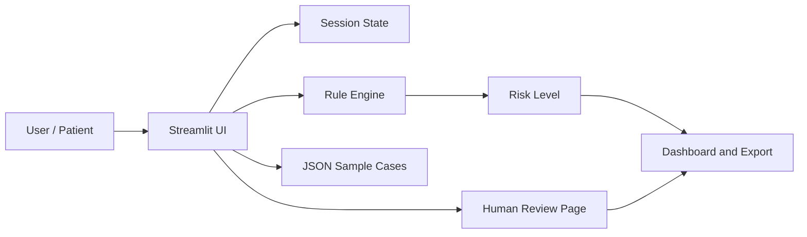

# Written Report Outline

**Project:** MedGuide AI: 医疗智能预问诊与风险分诊助手  
**Submission:** Written report + presentation slides  
**Presentation date:** 30 April 2026

## 1. Executive Summary

本项目开发了一个可运行的医疗智能预问诊原型，聚焦门诊前的信息采集、动态追问、风险分级与导诊建议。

Suggested summary points:

- Problem: outpatient pre-consultation is time-consuming and information is often incomplete.
- Solution: a bilingual Streamlit prototype with login, intake, dynamic follow-up, rule-based risk triage, optional AI summary, human review, and dashboard.
- Technology: Python + Streamlit + local JSON rules and optional OpenAI Responses API integration.
- Value: reduced intake time, improved structured information completeness, and more consistent red-flag reminders.
- Boundary: the prototype supports triage workflow but does not provide diagnosis or treatment.

## 2. Assignment Requirement Mapping

| Course requirement | How this project satisfies it |
| --- | --- |
| Runnable prototype or deep AI analysis | A runnable Streamlit prototype is provided in `app.py`. |
| Quantifiable benefits | The report compares intake time, completeness, capacity, and red-flag consistency. |
| Technology strategy / entrepreneurship | The solution is positioned as a B2B triage workflow tool for clinics and online healthcare platforms. |
| 15-minute final presentation | `SLIDES_OUTLINE.md` provides a 12-slide structure and speaking plan. |
| Critical reflection | The report discusses safety, hallucination, privacy, limited clinical validation, and human oversight. |

## 3. Problem Background

### 3.1 Real-World Pain Points

- Patients often describe symptoms in incomplete or unstructured language.
- Front-desk and triage staff spend time repeatedly asking the same baseline questions.
- Manual triage can vary by staff experience.
- Red-flag symptoms need consistent and visible escalation.

### 3.2 Why AI Is Suitable Here

AI is suitable for auxiliary workflow tasks:

- Turning free-text complaints into structured information.
- Asking targeted follow-up questions.
- Producing consistent summaries.
- Supporting triage staff with rule-based reminders.

Important boundary:

> The system is not an AI doctor. It is a pre-consultation and triage-support assistant.

## 4. Project Objectives

### 4.1 Functional Objectives

- Provide a login entry for the prototype.
- Support Chinese and English user interfaces.
- Collect structured intake information.
- Generate dynamic follow-up questions based on symptom category.
- Identify red-flag symptoms using transparent rules.
- Output risk level, recommended department, and structured summary.
- Generate an optional AI Smart Summary using OpenAI API or a local fallback.
- Provide a human review page and evaluation dashboard.

### 4.2 Measurable Objectives

Suggested targets for simulated evaluation:

- Reduce average manual intake time from 8 minutes to 3 minutes.
- Improve structured information completeness from 60% to 90%.
- Increase daily pre-screening capacity from 50 to 90 cases.
- Maintain clear red-flag escalation for high-risk demo cases.

## 5. Prototype Implementation

### 5.1 Current Version

The current prototype includes:

- `app.py`: main Streamlit application.
- `.streamlit/config.toml`: Streamlit theme using primary color `#4a90e2`.
- `data/rules.json`: bilingual red-flag rule examples.
- `data/sample_cases.json`: bilingual demo cases.
- `requirements.txt`: dependency list.

### 5.2 Pages Implemented

| Page | Purpose |
| --- | --- |
| Login | Demonstrates user entry and access boundary. |
| Home | Explains use case, safety boundary, and supported scenarios. |
| Intake | Collects basic patient and symptom information. |
| Follow-up | Asks targeted questions based on symptom category. |
| Result | Shows risk level, department, summary, reasoning, and red flags. |
| AI Smart Summary | Uses OpenAI API when configured; otherwise uses a local fallback summary. |
| Human Review | Shows how staff can review and adjust AI-supported output. |
| Dashboard | Supports quantified value and technical credibility discussion. |

### 5.3 Login and Database Decision

For the course prototype, a database is not required.

Current implementation:

- Demo users are stored in code.
- Session state tracks login status.
- No real patient data is stored.

Reason:

- The goal is to demonstrate workflow, not production identity management.
- Avoiding a database keeps setup simple and reproducible.
- It reduces privacy risk for a course project.

Future real deployment should include:

- Database or hospital identity system.
- Password hashing.
- Role-based access control.
- Audit logs.
- Session expiration.
- Data encryption and privacy compliance.

## 6. Technical Design

### 6.1 Architecture

### 6.2 Rule-First Safety Logic

The prototype uses rule-first triage:

- High-risk symptoms are checked before normal recommendation logic.
- Red-flag findings are displayed clearly.
- The system recommends human review when needed.

This design is more suitable for healthcare than a fully generative black-box approach.

### 6.3 AI Application Logic

The course prototype demonstrates AI-style application through:

- Natural-language chief complaint input.
- Symptom category recognition.
- Dynamic follow-up.
- Structured summarization.
- Risk explanation.
- Optional LLM-generated triage summary through the OpenAI Responses API.

The current implementation keeps LLM use optional. When an API key is configured, prompt engineering is used for flexible summary generation while rule-based safety constraints remain in control.

## 7. Evaluation Method

### 7.1 Research Method

Use simulated case evaluation:

1. Prepare bilingual sample cases across respiratory, digestive, skin, and high-risk scenarios.
2. Run each case through the prototype.
3. Compare the system output with expected risk levels.
4. Record time, completeness, and whether red flags were surfaced.
5. Reflect on failure modes and improvement directions.

### 7.2 Metrics

| Metric | Measurement Method |
| --- | --- |
| Intake time | Compare estimated manual time with prototype completion time. |
| Completeness | Count required fields completed before result generation. |
| Triage consistency | Compare expected and generated risk levels for sample cases. |
| Red-flag visibility | Check whether emergency or urgent factors are displayed. |
| Human review rate | Count cases where staff review is recommended or triggered. |

## 8. Quantifiable Benefits

| Metric | Traditional Process | Prototype Estimate | Improvement |
| --- | --- | --- | --- |
| Single intake time | 8 minutes | 3 minutes | -62.5% |
| Structured completeness | 60% | 90% | +50% |
| Daily capacity | 50 cases | 90 cases | +80% |
| Red-flag consistency | Depends on experience | Rule-first reminder | More stable |

Use these as simulated course assumptions, not real clinical claims.

## 9. Business Value

### 9.1 Target Users

- Clinics and outpatient departments.
- Online healthcare platforms.
- Corporate health-management services.
- Community healthcare centers.

### 9.2 Value Proposition

- Reduce repetitive front-desk questioning.
- Improve structured information quality before consultation.
- Help staff prioritize urgent cases.
- Standardize triage workflow.
- Improve patient experience through clearer guidance.

### 9.3 Business Model Ideas

- B2B SaaS subscription for clinics.
- API integration for telemedicine platforms.
- Per-institution monthly fee.
- Pilot deployment with community clinics.

## 10. Technology Strategy

The technical strategy aligns with business goals:

- Efficiency: automated intake reduces repeated manual questions.
- Safety: rule-first design keeps high-risk symptoms visible.
- Scalability: JSON rules can be expanded to more specialties.
- Trust: human review supports adoption in sensitive healthcare workflows.
- Differentiation: more flexible than fixed questionnaires and safer than pure generative AI.

## 11. Critical Reflection

### 11.1 Safety Risk

The largest risk is underestimating a high-risk case. The project addresses this by prioritizing red-flag rules and keeping human review.

### 11.2 Reliability Limitation

The current prototype uses simplified rules and simulated cases. It has not been validated in a real clinical environment.

### 11.3 Privacy Limitation

The prototype does not process real patient data. Real deployment would require strict data protection, access control, and audit mechanisms.

### 11.4 Scope Limitation

The current scope covers respiratory, digestive, skin, and high-risk example cases only. It cannot generalize to all diseases or specialties.

### 11.5 Team Decision Reflection

The team deliberately avoided building an “AI doctor.” This choice reduces medical risk and makes the project more suitable for a course prototype focused on AI application, business value, and critical reflection.

## 12. Conclusion

MedGuide AI demonstrates how AI can support healthcare workflows by improving pre-consultation efficiency, structuring symptom information, and highlighting red flags. Its strongest value is not replacing clinicians, but helping people reach better-prepared, safer, and more standardized human review.

## 13. Appendix Suggestions

Include:

- Screenshots of each prototype page.
- System workflow diagram.
- Sample-case input and output screenshots.
- Red-flag rule table.
- Team contribution record.
- Q&A preparation notes.
