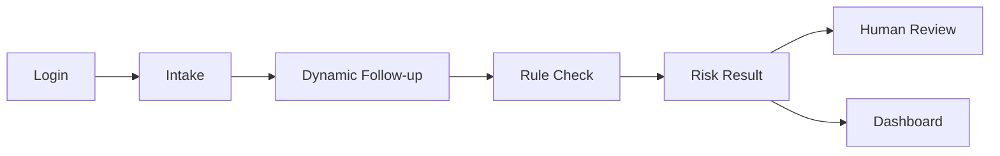
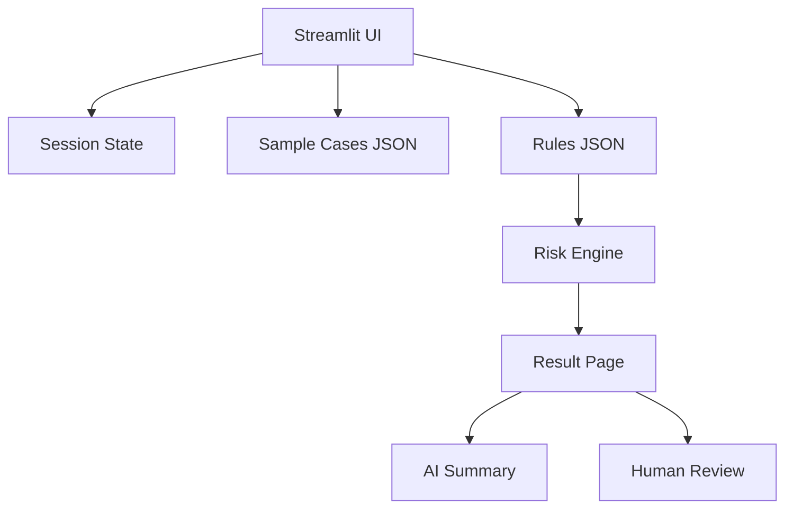

# 15-Minute Presentation Slides Outline

**Project:** MedGuide AI: 医疗智能预问诊与风险分诊助手  
**Format:** 10-12 slides, 15 minutes, all members participate  
**Demo:** Streamlit runnable prototype

## Slide 1. Title

Content:

- MedGuide AI.
- AI Pre-Consultation and Risk Triage Assistant.
- Team members.
- Course name.
- Presentation date: 30 April 2026.

Speaker focus:

- Explain in one sentence: this is a pre-consultation and triage-support prototype, not an AI doctor.

## Slide 2. Problem

Content:

- Patients often provide incomplete symptom descriptions.
- Front-desk and triage staff repeat many basic questions.
- Manual triage consistency depends on experience.
- Red-flag symptoms need clearer and faster escalation.

Visual suggestion:

- A simple “before consultation” workflow diagram.

## Slide 3. Scope and Boundary

Content:

| We Do | We Do Not Do |
| --- | --- |
| Pre-consultation intake | Medical diagnosis |
| Risk-level suggestion | Treatment recommendation |
| Red-flag reminder | Replacing clinicians |
| Human review support | Processing real patient data |

Speaker focus:

- This slide protects the project from being misunderstood as automated diagnosis.

## Slide 4. Solution Overview

Content:

Key phrase:

> Rule-first safety + structured AI-style interaction + human oversight.

## Slide 5. Prototype Pages

Content:

- Login page with demo accounts.
- Home and disclaimer.
- Intake form.
- Dynamic follow-up page.
- Triage result page.
- AI Smart Summary section.
- Human review page.
- Rules and evaluation dashboard.

Speaker focus:

- Mention bilingual support: 中文 / English.
- Mention primary UI color: `#4a90e2`.

## Slide 6. Live Demo Flow

Recommended demo sequence:

1. Login with `demo / demo123`.
2. Switch language if needed.
3. Load one sample case.
4. Complete intake.
5. Answer follow-up questions.
6. Show risk result.
7. Generate AI Smart Summary.
8. Open human review or dashboard.

Backup plan:

- Prepare screenshots in case live demo is slow.

## Slide 7. Technical Architecture

Content:

- Frontend/runtime: Streamlit.
- State: `st.session_state`.
- Data: local JSON rules and sample cases.
- Logic: symptom category detection + red-flag rules + risk output.
- AI module: optional OpenAI Responses API for smart summary generation.
- Authentication: demo login, no database required for course prototype.

Diagram:

Speaker focus:

- Explain why avoiding a database is reasonable for a course prototype.
- Explain what would change in real deployment.
- Explain that the OpenAI API is optional and the app has a fallback for demo stability.

## Slide 8. Rule and Safety Design

Content:

- Red flags are prioritized before normal recommendations.
- Emergency symptoms produce clear warnings.
- Results include reasoning and disclaimer.
- Human review remains available.

Example:

- Chest pain + breathing difficulty -> emergency recommendation.
- Fast-spreading rash with fever -> see a doctor soon.

## Slide 9. Quantifiable Benefits

Content:

| Metric | Manual | Prototype | Improvement |
| --- | --- | --- | --- |
| Intake time | 8 min | 3 min | -62.5% |
| Completeness | 60% | 90% | +50% |
| Daily capacity | 50 | 90 | +80% |
| Red-flag reminder | Experience-based | Rule-first | More consistent |

Speaker focus:

- State clearly that these are simulated course evaluation assumptions.

## Slide 10. Business Value and Strategy

Content:

- Clinics: reduce repetitive triage workload.
- Online healthcare platforms: improve pre-consultation data quality.
- Patients: clearer symptom organization and guidance.
- Organizations: more standardized workflow.

Business model:

- B2B SaaS.
- API integration.
- Subscription by clinic or institution.

## Slide 11. Critical Reflection

Content:

- Risk of misclassification.
- Limited symptom coverage.
- No real clinical validation yet.
- Privacy and compliance requirements.
- LLM hallucination risk if connected later.

Speaker focus:

- Show that the team understands limitations and safety responsibilities.

## Slide 12. Closing and Q&A

Closing sentence:

> MedGuide AI shows that AI’s most realistic healthcare value is not replacing doctors, but improving pre-consultation efficiency, risk visibility, and human decision support.

Q&A prompt:

- Invite questions on technical design, business value, and safety limitations.

## Timing Plan

| Section | Slides | Time |
| --- | --- | --- |
| Problem and scope | 1-3 | 3 minutes |
| Solution and demo | 4-6 | 5 minutes |
| Technical design | 7-8 | 3 minutes |
| Value and strategy | 9-10 | 2.5 minutes |
| Reflection and Q&A transition | 11-12 | 1.5 minutes |

## Team Speaking Plan

For a 4-person team:

- Member A: Slides 1-3.
- Member B: Slides 4-6 and live demo.
- Member C: Slides 7-8.
- Member D: Slides 9-12.

For a 3-person team:

- Member A: Slides 1-4.
- Member B: Slides 5-8 and live demo.
- Member C: Slides 9-12.

## High-Probability Q&A

### Q1. Why not build an AI diagnosis system?

Answer:

Medical diagnosis has high safety and legal risk. Our project focuses on pre-consultation, risk triage, and structured information support, which is safer and more suitable for a course prototype.

### Q2. Does the login page need a database?

Answer:

Not for this prototype. Demo accounts are enough to show the user entry and access boundary. A real deployment would require database-backed authentication, encryption, role-based permissions, and audit logs.

### Q2.5. Where is AI used?

Answer:

AI is used in two layers. First, the prototype uses AI-style logic for symptom classification, dynamic follow-up, rule-based risk triage, and structured output. Second, the result page can call the OpenAI Responses API to generate a triage-facing smart summary when an API key is configured.

### Q3. How are the quantified benefits calculated?

Answer:

They are simulated evaluation assumptions based on comparing manual intake with the prototype workflow. We present them as course evaluation estimates, not real hospital statistics.

### Q4. What if the system gives the wrong risk level?

Answer:

That is why the prototype uses red-flag rules, disclaimers, and human review. It is designed to support staff, not replace them.

### Q5. What is the biggest limitation?

Answer:

The current prototype has limited symptom coverage and no real clinical validation. Future work requires clinical expert review, privacy design, and controlled pilot testing.

## Slide Design Notes

- Use `#4a90e2` as the main blue.
- Avoid dense paragraphs; use diagrams and screenshots.
- Keep bilingual labels where useful, but do not overcrowd slides.
- Include screenshots of the actual Streamlit pages.
- Keep the live demo under 3 minutes.
